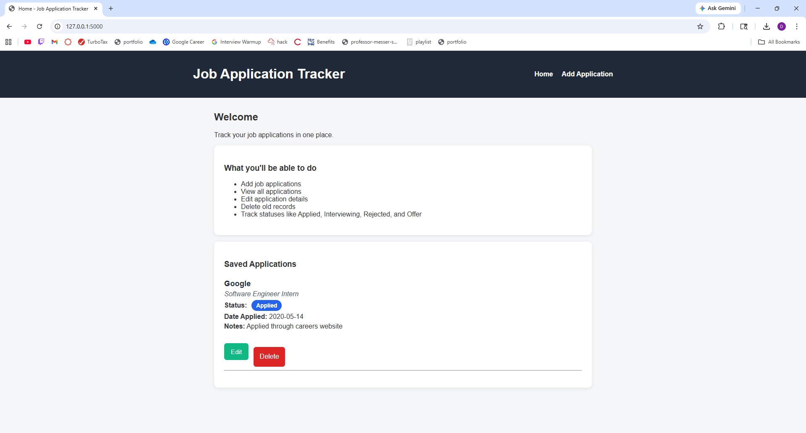
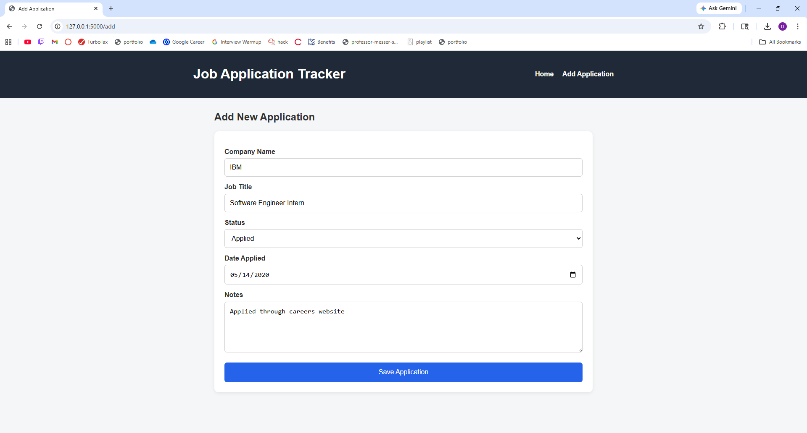
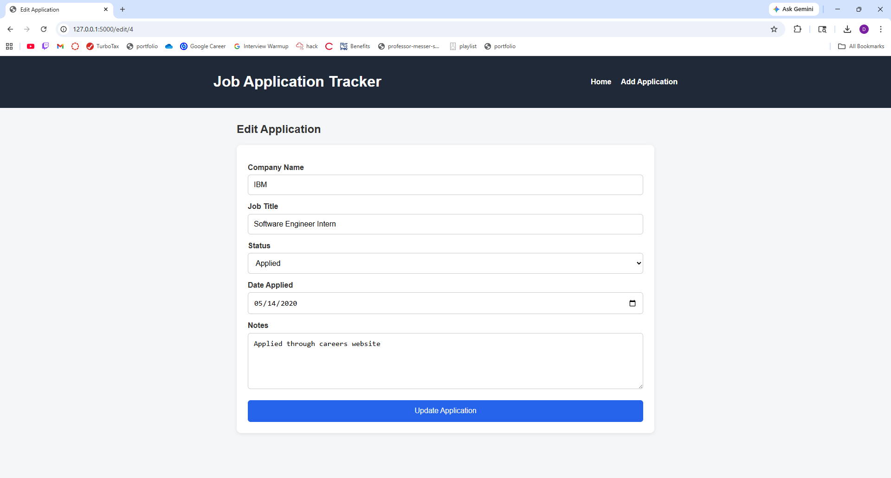
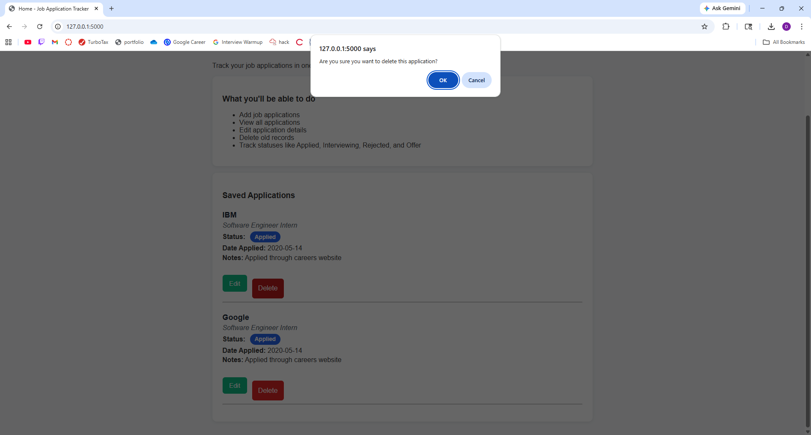

# Job Application Tracker

A full-stack Flask web application that helps users track job applications in one place.

## Features

- Add job applications
- View saved applications
- Edit application details
- Delete applications with confirmation
- Track application status with color-coded badges
- Store data using SQLite

## Tech Stack

- Python
- Flask
- SQLite
- HTML
- CSS

## Screenshots









## How to Run Locally

1. Clone the repository
2. Open the project folder
3. Create and activate a virtual environment
4. Install dependencies:
   ```bash
   pip install -r requirements.txt
5. Initialize the database:
	py init_db.py
6. Run the app:
	py app.py

## Project Purpose

This project was built to strengthen full-stack software engineering skills by practicing CRUD operations, routing, database integration, and frontend styling using Flask and SQLite.